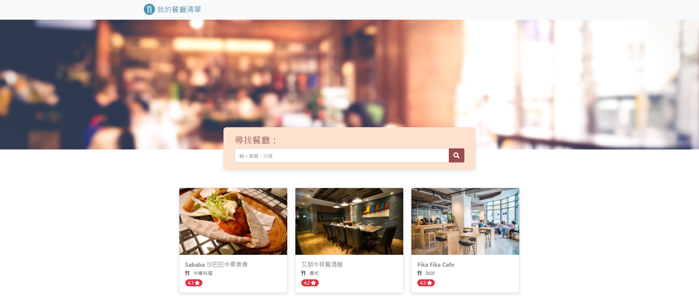

# restaurant-list


## 介紹
1.瀏覽我的餐廳清單
2.點擊餐廳查看餐廳詳細資訊
3.搜尋特定餐廳

## 開始使用
1. 請先確認有安裝 node.js 與 npm
2. 將專案 clone 到本地
3. 在本地開啟之後，透過終端機進入資料夾，輸入：

   ```bash
   npm install
   ```

4. 安裝完畢後，繼續輸入：

   ```bash
   npm run start
   ```

5. 若看見此行訊息則代表順利運行，打開瀏覽器進入到以下網址

   ```bash
   Listening on http://localhost:3000
   ```

6. 若欲暫停使用

   ```bash
   ctrl + c
   ```

## 開發工具
Node.js 10.15.0
Express 4.17.1
Express-Handlebars 5.3.3
Bootstrap 4.3.1
Font-awesome 5.8.1
